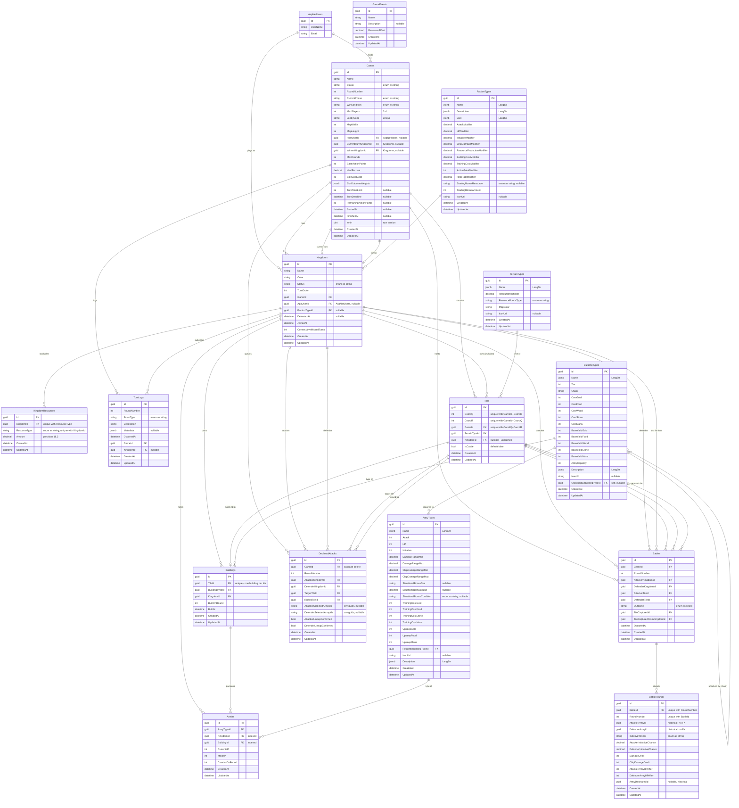

# Backend Database Schema

Database: **PostgreSQL** via Entity Framework Core (`Backend/Infrastructure/AppDbContext.cs`).
All entities inherit from `BaseEntity` (`Id: Guid`, `CreatedAt`, `UpdatedAt`).
Identity tables (`AspNetUsers`, `AspNetRoles`, `AppRefreshToken`, `DataProtectionKeys`, …) come from `IdentityDbContext` and are shown only at the boundary where domain entities reference them.

## Visual ERD

Two SVG diagrams generated from the live PostgreSQL schema (open in a browser to zoom):

- [`db-schema.svg`](db-schema.svg) — full ERD with **all columns** visible (the canonical visual)
- [`db-schema-compact.svg`](db-schema-compact.svg) — **PK/FK only**, easier to skim at a glance

To regenerate after schema changes (requires the dev DB to be running and migrated):

```bash
docker run --rm --network host \
  -v "$PWD/DOCS/schemaspy:/output" \
  schemaspy/schemaspy:latest \
  -t pgsql11 -host localhost -port 5432 \
  -db postgres-dev -u postgres -p postgres -s public -vizjs \
  -I "__EFMigrationsHistory|DataProtectionKeys"

cp DOCS/schemaspy/diagrams/summary/relationships.real.large.svg   DOCS/db-schema.svg
cp DOCS/schemaspy/diagrams/summary/relationships.real.compact.svg DOCS/db-schema-compact.svg
rm -rf DOCS/schemaspy
```

The Mermaid block below is the inline-readable, hand-annotated version — it carries prose notes (cascade-delete behavior, `xmin` row version, historical FK-less references) that the auto-generated SVGs don't.

> Diagram conventions: `PK` = primary key, `FK` = foreign key. Unique indexes are noted in the inline comment (e.g. `"unique"`) and listed in full under **Notes** below. `||--o{` = one-to-many; `||--o|` = one-to-(zero-or-)one. Reference / lookup tables are grouped at the bottom.

## Entity Relationships



## Notes

- **Cascade deletes are disabled globally** in `OnModelCreating` (`DeleteBehavior.Restrict`). The only explicit cascade is `DeclaredAttacks → Games`.
- **Enums are persisted as strings** via `HasConversion<string>()` for `Game.Status`, `Game.WinCondition`, `Game.CurrentPhase`, `Kingdom.Status`, `TurnLog.EventType`, `Battle.Outcome`, `BattleRound.InitiativeWinner`, `ArmyType.SituationalBonusCondition`, `FactionType.StartingBonusResource`, `KingdomResource.ResourceType`, and `TerrainType.ResourceBonusType`.
- **Localized strings** (`LangStr`) on lookup tables are stored as `jsonb` columns.
- **Concurrency:** `Games.xmin` is mapped to PostgreSQL's system row-version column to guard against lobby-join races.
- **Unique indexes:**
  - `Games.LobbyCode`
  - `Tiles (GameId, CoordQ, CoordR)`
  - `KingdomResources (KingdomId, ResourceType)`
  - `Buildings.TileId` — enforces one building per tile
  - `BattleRounds (BattleId, RoundNumber)`
- **Non-unique indexes** for hot query paths: `TurnLogs (GameId, RoundNumber)`, `TurnLogs (GameId, KingdomId)`, `Armies.BuildingId`, `Armies.KingdomId`.
- **Historical references:** `BattleRound.AttackerArmyId`, `DefenderArmyId`, and `ArmyDestroyedId` are plain `Guid` columns *without* FK constraints — armies may be destroyed and removed during combat, but the round log must still reference them.
- **CSV-encoded lineups:** `DeclaredAttack.AttackerSelectedArmyIds` / `DefenderSelectedArmyIds` store comma-separated GUID lists; not relational FKs.
- **`HostUserId` and `Kingdom.AppUserId`** are FK columns to `AspNetUsers` configured *without* navigation properties — Domain has no reference to the Identity layer.
- **`SaveChangesAsync` auto-stamps** `CreatedAt` / `UpdatedAt` on every entity implementing `IBaseEntity`. All `DateTime` columns are forced to UTC via value converters because `timestamp with time zone` requires UTC.
```
